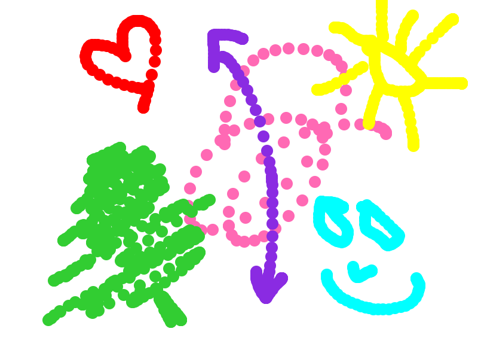

# 🤖Welcome to the Developer Playhouse, a creative sandbox where human intuition meets machine precision. 
I stumbled upon this JS design while learning about the `anchor element` and using `the download attribute to save a <canvas>` as a PNG. While taking Google's Web Development courses, I was introduced to the MDN Web Docs site, which led me to a playground demo of a painting app. I used this as a foundation and added my own features—like a color swatch, a share button, a 'clear canvas' button and brush size button. I built the navigation bar to showcase how that same element can handle emails, calls, and downloads, and demonstrate the `anchor element’s versatility, all decorated with subtle animations.
 
- We encourage users to use this demo site to create your own logo if you have that artistic vibe in you.

``This project is a digital canvas designed for collaboration, experimentation, and a little bit of world-domination prep.``

### 👤 Author
**Jacqueline**  
[Check out my GitHub Profile](https://github.com/jdbostonbu-ops)

🚀 **[Visit the Developer Playhouse](https://jdbostonbu-ops.github.io/DeveloperPlayhouse/)**

# 🎨 Recent Masterpiece used as my favicon for the website.

# 🌐 Browser & Device Compatibility

| Browser / Device | Status | Performance Notes |
| :--- | :--- | :--- |
| **Google Chrome** | ✅ Compatible | Full support for Chrome and Chromium-based rendering. Share Button shares a painting with a BLACK background canvas. |
| **Safari** | ✅ Compatible | Full support for Safari and WebKit rendering. Share Button shares a painting with a WHITE background canvas.|
| **Microsoft Edge** | ✅ Compatible | Full support for Edge (Chromium) rendering. Share Button shares a painting with a BLACK background canvas. |
| **Firefox** | ⚠️ Partial | Share and Clear Canvas features are unavailable; Download does not display PNG files. |
| **iPad / Tablets** | ✅ Compatible | Optimized for touch-to-canvas interactions and 2D drawing. |
| **Microsoft Surface** | ✅ Compatible | Full support for stylus and touch-based state management. |
| **iPhone (iOS)** | ❌ Not Supported | Small-screen iOS is not currently optimized for canvas scaling. |

> **Note:** The Developer Playhouse is a high-precision digital canvas designed for larger viewports. While it works across most modern desktop engines, a tablet or desktop screen is required for the intended creative experience.

# 📖 About the Project
The Playhouse is a space to express yourself through code and color. It serves as a bridge between learning and doing:
- **Education:** Includes links to the Google online courses and MDN (developer.mozilla.org) resources that I used to build this site.
- **Testing:** A dedicated space to test your code and experiment with "features" (not bugs) found in one of the nav links along with the original save a canvas as a PNG demo.
- **Creation:** Use the interactive canvas to build your masterpiece, then save your creation to your local machine before the machines take over.

# 🚀 Key Features
- **Interactive Painting:** Smooth, arc-based brush strokes for a natural feel.
- **Dynamic Swatches:** Easily swap between colors with visual 'active' states.
- **Reliable Downloads:** High-performance "Force Download" logic using `toBlob` to ensure your art is saved correctly as a .png on any OS.
- **Clean Slate:** Every session starts with a crisp white background, ready for your first spark of inspiration.

# 🛠️ Technical Highlights (JavaScript)
The engine behind the Playhouse uses a 2D Canvas API with a few clever tricks:
- **State Management:** Tracks `isDrawing` via mousedown/mouseup listeners to ensure you only paint when you want to.
- **Memory Management:** Automatically revokes object URLs after downloads to keep the browser running lean.
- **Collaborative Spirit:** A space where machines and humans create together using a Creative Collaboration logic.

# 🎮 How to Use
- **Pick a color** from the dynamic swatches.
- **Click and drag** on the canvas to start collaborating with the machine.
- **Click the Download Link** to save your `my_painting.png` forever.
- **Share** your masterpiece by text, email, airdrop, save image, assign to contact, add to social media or add to any app listed on your iPhone as a .png file.

